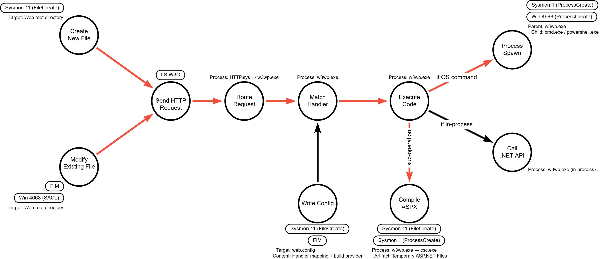

# File-Based Web Shell Execution via IIS

## Metadata

| Key          | Value                                          |
|--------------|------------------------------------------------|
| ID           | TRR0000                                        |
| External IDs | [T1505.003]                                    |
| Tactics      | Persistence                                    |
| Platforms    | Windows                                        |
| Contributors | John                                           |

### Scope Statement

This TRR covers file-based web shells on IIS running on Windows. Execution
mechanics differ across web server platforms due to differences in request
processing, handler models, and scripting engines; this report focuses on IIS
because of its deep integration with Windows and the ASP/ASP.NET pipeline.

Out of scope:

- Fileless or memory-only web shells (different essential operations)
- ASP.NET Core on IIS (different execution model; IIS proxies to Kestrel)
- PHP on IIS via FastCGI (different execution model via `php-cgi.exe`)
- Non-Windows platforms (Apache, Nginx, Tomcat, etc.)

Server-Side Includes (SSI) via `ssinc.dll` are discussed in Technical
Background but not treated as a separate procedure — SSI-based shells follow
the same essential operations as Procedures A and B.

This technique maps to MITRE ATT&CK [T1505.003].

## Technique Overview

A web shell is a malicious script placed on a web server that gives an attacker
remote command execution through the server's HTTP request-handling mechanisms.
File-based web shells persist as script files on disk and execute through the
server's handler mappings. They are attractive to adversaries because they
survive reboots, blend with normal web traffic on ports 80/443, and require no
additional software. This TRR covers file-based web shells on IIS; fileless web
shells involve different essential operations and are documented separately.

## Technical Background

### IIS Architecture

Internet Information Services (IIS) is Microsoft's web server, included with
Windows Server. Every web shell on IIS must pass through the same request
processing pipeline regardless of the shell's implementation.

#### HTTP.sys

All HTTP/HTTPS traffic destined for IIS passes through HTTP.sys, a kernel-mode
driver that listens on configured ports (typically 80 and 443). HTTP.sys
handles connection management, caching, and request routing. When a request
requires application code, HTTP.sys routes it to the appropriate application
pool based on site bindings. HTTP.sys operates at the kernel level, below the
reach of most telemetry sources.

#### Application Pools

An application pool is an isolation boundary within IIS. Each pool runs as its
own instance of the worker process `w3wp.exe`, with its own security identity
and resource limits. The pool's configured identity determines the security
context under which all code executes — including web shell code.

By default, pools run under low-privilege virtual accounts (e.g.,
`IIS AppPool\DefaultAppPool`). Administrators sometimes configure pools to use
higher-privilege accounts such as `NetworkService`, domain service accounts, or
`LocalSystem`. The web shell inherits whatever permissions the pool identity
has.

#### The IIS Worker Process (w3wp.exe)

The worker process `w3wp.exe` is the most important component for understanding
web shell execution. It loads and executes requested files using the
appropriate scripting engine, runs under the application pool's identity, and
can spawn child processes.

When a web shell executes OS commands by starting external programs (such as
`cmd.exe` or `powershell.exe`), those programs appear as child processes of
`w3wp.exe`. Under normal operations, `w3wp.exe` rarely spawns command
interpreters.

However, web shells that operate exclusively through .NET framework APIs (e.g.,
`System.IO.File`, `System.Net.WebClient`, `System.Data.SqlClient`) execute
entirely within `w3wp.exe` without spawning a child process. This distinction
is the basis for two of the procedures in this TRR.

### Handler Mappings

IIS uses handler mappings to determine how to process a requested file. When a
request arrives, IIS examines the file extension to determine whether the file
should be served as static content or processed by a scripting engine.

On a default IIS installation with ASP.NET enabled, the following extensions
are mapped to executable handlers:

- `.aspx` — ASP.NET engine
- `.asp` — Classic ASP engine
- `.ashx` — ASP.NET generic handler
- `.asmx` — ASP.NET web service handler

IIS also supports Server-Side Includes (SSI) via `ssinc.dll`. If enabled,
files with extensions `.shtml`, `.stm`, and `.shtm` can execute directives
such as `<!--#exec cmd="command">`.

For a web shell to function under default handler mappings, it must use a file
extension already mapped to an executable handler. This is an essential and
immutable constraint — unless the attacker modifies the handler mappings
themselves (see web.config section below).

### ASP vs. ASP.NET Execution

Classic ASP files (`.asp`) are interpreted directly by `asp.dll` inside
`w3wp.exe`. No additional artifacts are produced on disk.

ASP.NET files (`.aspx`) undergo a compilation step. On first request, the
ASP.NET engine compiles the source into a .NET assembly (DLL) stored in
`C:\Windows\Microsoft.NET\Framework64\<version>\Temporary ASP.NET Files\`.
On .NET Framework 4.8 (widely deployed), this compilation spawns `csc.exe` as
a child process of `w3wp.exe`. On ASP.NET Core with the Roslyn in-process
compiler, compilation may occur without a child process.

The compilation produces several artifacts in Temporary ASP.NET Files: a
`.compiled` metadata file, the compiled assembly (`.dll`), intermediate C#
source files (`.cs`), and compiler I/O files. The `.compiled` file's name
preserves the original source extension — e.g., `shell.aspx.cdcab7d2.compiled`
or `readme.txt.cdcab7d2.compiled` if a `.txt` file has been configured for
ASP.NET execution via handler manipulation (see Procedure C).

### The Web Root and Virtual Directories

Every IIS site maps to a physical directory (default: `C:\inetpub\wwwroot\`).
Virtual directories can extend the web-accessible area to other paths. For a
web shell to be reachable via HTTP, the shell file must reside within a
web-accessible path.

### web.config and Handler Manipulation

IIS configuration can be modified at the directory level through `web.config`
files. A `web.config` placed in any web-accessible directory overrides IIS
settings for that directory and its subdirectories.

An attacker who can write a `web.config` can manipulate handler mappings in two
ways. First, they can add a custom handler mapping that routes a normally static
extension (`.jpg`, `.txt`, `.png`) through the ASP.NET engine, then place a
web shell with that extension. Second, they can define an inline `IHttpHandler`
within the `web.config` itself — no separate script file needed.

The custom handler mapping variant requires two configuration elements: a
`<handlers>` entry routing the extension to `PageHandlerFactory`, and a
`<buildProviders>` entry registering `PageBuildProvider` for the extension.
Without both, ASP.NET fails with a compilation error. The `<buildProviders>`
element can only be defined at the IIS Application level — ASP.NET returns a
configuration error if it appears below the application root. This means the
custom handler variant requires either that the target directory is already an
IIS Application, the attacker can modify the site root's `web.config`, or the
attacker can modify `machine.config` (requires SYSTEM access).

When a `web.config` is placed in a subdirectory, IIS dynamically reloads that
directory's configuration without a server restart.

### IIS Application Initialization

IIS Application Initialization can be configured through `web.config` to send
internal warmup requests to specified pages on app pool start, recycle, or
reboot. If an attacker designates a web shell as a preload page, IIS will
automatically trigger it on every lifecycle event — transforming the shell from
a passive backdoor into one that auto-executes without an attacker-initiated
request.

## Procedures

| ID             | Title                                    | Tactic      |
|----------------|------------------------------------------|-------------|
| TRR0000.WIN.A  | Web Shell with OS Command Execution      | Persistence |
| TRR0000.WIN.B  | Web Shell with In-Process Execution      | Persistence |
| TRR0000.WIN.C  | Web Shell via web.config Manipulation    | Persistence |

### Procedure A: Web Shell with OS Command Execution

A malicious script file (`.aspx` or `.asp`) is placed in a web-accessible
directory — either as a new file or injected into an existing one. The delivery
method is tangential; the essential prerequisite is that malicious code exists
on disk in a path IIS is configured to serve.

When the attacker requests the shell's URL, the request enters the IIS
pipeline, is routed to `w3wp.exe`, matched to the appropriate handler, and
executed. The web shell then calls a process-creation API (e.g.,
`System.Diagnostics.Process.Start()`) to spawn an external program — typically
`cmd.exe` or `powershell.exe` — with attacker-supplied arguments. The child
process executes the command and the output is returned in the HTTP response.

The Process Spawn operation distinguishes this procedure from Procedure B.

#### Detection Data Model

File prerequisites feed into the shared pipeline (Route Request → Match Handler
→ Execute Code). The distinguishing operation is Process Spawn from `w3wp.exe`.
Compile ASPX is a sub-operation of Execute Code, relevant only for `.aspx`
shells.

### Procedure B: Web Shell with In-Process Execution

This procedure shares the same prerequisites and pipeline as Procedure A
through Execute Code. The difference is that the web shell never spawns a child
process — it operates exclusively through .NET framework APIs or COM objects
within `w3wp.exe` (e.g., `System.IO.File.ReadAllText()`,
`System.Net.WebClient`, `System.Data.SqlClient`).

The specific API calls are attacker-controlled and tangential. The side effects
of those calls may produce telemetry depending on the action taken.

#### Detection Data Model

Identical to Procedure A through Execute Code. Diverges at the final step:
Call .NET API instead of Process Spawn. The Call .NET API operation has no
direct telemetry — only its side effects may be observable.

### Procedure C: Web Shell via web.config Manipulation

This procedure introduces Write Config as an essential operation not present in
Procedures A or B. Write Config changes the essential operation chain in two
ways: it removes the constraint that the file extension must match a
default handler mapping, and in the inline `IHttpHandler` variant, it
eliminates the separate script file prerequisite entirely.

Two variants exist. In the custom handler mapping variant, the attacker writes
a `web.config` with both a handler mapping and build provider registration,
then places a shell with a normally static extension. The build provider must
be defined at the IIS Application level. In the inline handler variant, the
attacker defines an `IHttpHandler` directly in the `web.config` — no separate
file needed.

Both variants require writing a `web.config` to a web-accessible directory.
The downstream pipeline operates the same as Procedures A and B; post-execution
behavior depends on the shell's code.

Application Initialization can further enhance persistence by configuring IIS
to auto-trigger the shell on app pool lifecycle events (see Technical
Background).

When ASP.NET compiles a non-standard extension (custom handler variant), the
`.compiled` metadata file preserves the original extension in its filename
(e.g., `readme.txt.cdcab7d2.compiled`).

#### Detection Data Model

Write Config feeds into Match Handler, reflecting its modification of handler
matching. In the inline variant, Write Config is the sole prerequisite. In the
custom handler variant, it is accompanied by a file operation. The downstream
pipeline and post-execution branches remain the same as Procedures A and B.

## Available Emulation Tests

| ID             | Link                |
|----------------|---------------------|
| TRR0000.WIN.A  | [Atomic Test T1505.003-1], [Atomic Test T1505.003-2] |
| TRR0000.WIN.B  |                     |
| TRR0000.WIN.C  |                     |

## References

- [IIS Architecture Overview - Microsoft Learn]
- [Handler Mappings in IIS - Microsoft Learn]
- [Application Pools in IIS - Microsoft Learn]
- [ASP.NET Compilation Overview - Microsoft Learn]
- [Virtual Directories in IIS - Microsoft Learn]
- [web.config Reference - Microsoft Learn]
- [IIS Application Initialization - Microsoft Learn]
- [Server-Side Includes in IIS - Microsoft Learn]
- [IHttpHandler Interface - Microsoft Learn]
- [Detect and Prevent Web Shell Malware - NSA/CISA]
- [Web Shell Attacks Continue to Rise - Microsoft Security Blog]
- [Ghost in the Shell: Investigating Web Shell Attacks - Microsoft Security Blog]
- [Web Shell Detection: Script Process Child of Common Web Processes - Elastic Security]
- [Mo' Shells Mo' Problems: Deep Panda Web Shells - CrowdStrike]
- [T1505.003 - MITRE ATT&CK]

[T1505.003]: https://attack.mitre.org/techniques/T1505/003/
[IIS Architecture Overview - Microsoft Learn]: https://learn.microsoft.com/en-us/iis/get-started/introduction-to-iis/introduction-to-iis-architecture
[Handler Mappings in IIS - Microsoft Learn]: https://learn.microsoft.com/en-us/iis/configuration/system.webserver/handlers/
[Application Pools in IIS - Microsoft Learn]: https://learn.microsoft.com/en-us/iis/configuration/system.applicationhost/applicationpools/
[ASP.NET Compilation Overview - Microsoft Learn]: https://learn.microsoft.com/en-us/previous-versions/aspnet/ms178466(v=vs.100)
[Virtual Directories in IIS - Microsoft Learn]: https://learn.microsoft.com/en-us/iis/configuration/system.applicationhost/sites/site/application/virtualdirectory
[web.config Reference - Microsoft Learn]: https://learn.microsoft.com/en-us/iis/configuration/
[IIS Application Initialization - Microsoft Learn]: https://learn.microsoft.com/en-us/iis/configuration/system.webserver/applicationinitialization/
[Server-Side Includes in IIS - Microsoft Learn]: https://learn.microsoft.com/en-us/iis/configuration/system.webserver/serversideinclude
[IHttpHandler Interface - Microsoft Learn]: https://learn.microsoft.com/en-us/dotnet/api/system.web.ihttphandler
[Detect and Prevent Web Shell Malware - NSA/CISA]: https://media.defense.gov/2020/Jun/09/2002313081/-1/-1/0/CSI-DETECT-AND-PREVENT-WEB-SHELL-MALWARE-20200422.PDF
[Web Shell Attacks Continue to Rise - Microsoft Security Blog]: https://www.microsoft.com/en-us/security/blog/2021/02/11/web-shell-attacks-continue-to-rise/
[Ghost in the Shell: Investigating Web Shell Attacks - Microsoft Security Blog]: https://www.microsoft.com/en-us/security/blog/2020/02/04/ghost-in-the-shell-investigating-web-shell-attacks/
[Web Shell Detection: Script Process Child of Common Web Processes - Elastic Security]: https://www.elastic.co/docs/reference/security/prebuilt-rules/rules/windows/persistence_webshell_detection
[Mo' Shells Mo' Problems: Deep Panda Web Shells - CrowdStrike]: https://www.crowdstrike.com/en-us/blog/mo-shells-mo-problems-deep-panda-web-shells/
[T1505.003 - MITRE ATT&CK]: https://attack.mitre.org/techniques/T1505/003/
[Atomic Test T1505.003-1]: https://github.com/redcanaryco/atomic-red-team/blob/master/atomics/T1505.003/T1505.003.md#atomic-test-1---deploy-asp-webshell
[Atomic Test T1505.003-2]: https://github.com/redcanaryco/atomic-red-team/blob/master/atomics/T1505.003/T1505.003.md#atomic-test-2---deploy-aspx-webshell
